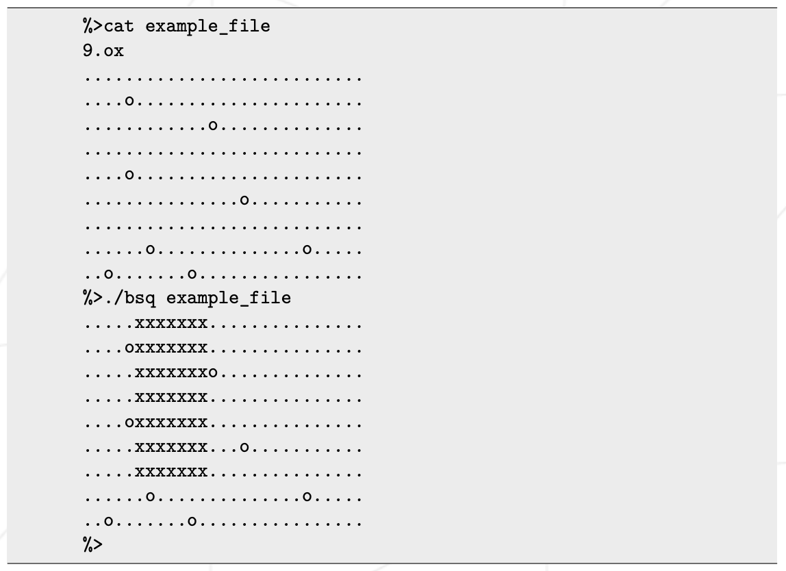

# BSQueue
Temp repo for working on the BSQ project



[map_generator.pl](map_generator.pl) example: \
```$ perl map_generator.pl 20 10 4 > mapfile.txt```\
 <sub>("20"=X-size, "10"=Y-size, "4"=Density, "mapfile.txt"=Output-Target)